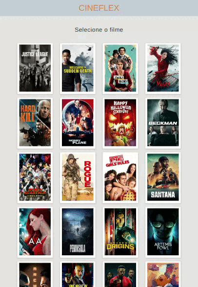

<p align="center"></p>

# <p align="center">Cineflex</p>

### <p align="center">App de cinema</p>

<p align="center">
    
    
    
    
    
</p>

## :clipboard: Descrição

Este é um projeto SPA (Single Page Application) construído com React que permite aos usuários escolher um filme, horário e assentos disponíveis para compra de ingressos de cinema. O projeto consome uma API externa através do axios e gera um bilhete com as escolhas do usuário. Com uma interface intuitiva e fácil de usar, este projeto oferece aos usuários uma experiência de seleção de ingressos de cinema simples e eficiente.

:movie_camera: [**Acesse aqui**](https://cineflex-gabrielatiago.vercel.app)

---

### :rocket: Rodando o projeto localmente

Este projeto foi iniciado com [Create React App](https://github.com/facebook/create-react-app), portanto, certifique-se de ter a última versão estável do [Node.js](https://nodejs.org/en/download) e [npm](https://www.npmjs.com/) rodando localmente.

Primeiro de tudo, clone este projeto ou faça o download do ZIP.

Para realizar o clone, no terminal de sua máquina, utilize o [git](https://git-scm.com/) e insira o seguinte comando:

```bash
    git clone git@github.com:GabrielaTiago/Cineflex.git
```

Entre na pasta do projeto

```bash
    cd Cineflex
```

Execute o seguinte comando para instalar as dependências.

```bash
    npm install
```

Depois de instalar as dependências, execute o comando para iniciar a aplicação.

```bash
    npm run start
```

A aplicação será iniciada em `http://localhost:3000` no seu navegador.

---

## :computer: Telas

### Desktop


### Tablet



### Mobile


## 🎮 Usando

https://user-images.githubusercontent.com/77814822/216130702-436296db-8edf-42b1-90c6-df13fa7d036b.mp4

## :books: Lições Aprendidas

- SPA
- Consumir API com axios
- Links internos
- Rotas
- Paginação
- useMemo
- Regex
- Styled Components

## :bulb: Reconhecimentos

- [Badges para Github](https://github.com/alexandresanlim/Badges4-README.md-Profile#-database-)
- [Inspiração de README](https://gist.github.com/luanalessa/7f98467a5ed62d00dcbde67d4556a1e4#file-readme-md)
- [Driven Education](https://www.driven.com.br)
- [Máscara CPF](https://github.com/JoaoLucas8760/MaskForm/blob/main/Readme.md?plain=1)

## :muscle: Contribuição

Contribuições são bem-vindas! Se você encontrar algum problema ou tiver sugestões de melhoria, abra uma _issue_ ou envie um _pull request_.

## :woman_technologist: Autora

Gabriela Tiago de Araújo

- email: <gabrielatiagodearaujo@outlook.com>
- linkedin: <https://www.linkedin.com/in/gabrielatiago/>
- portfolio: <https://gabrielatiago.vercel.app>

$~$

[🔝 De volta ao topo](#cineflex)
